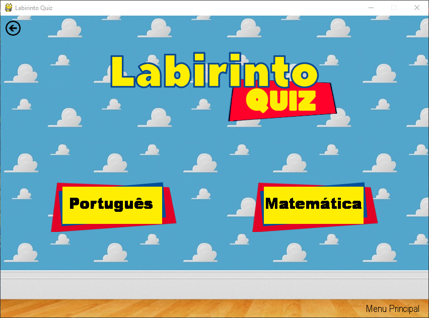
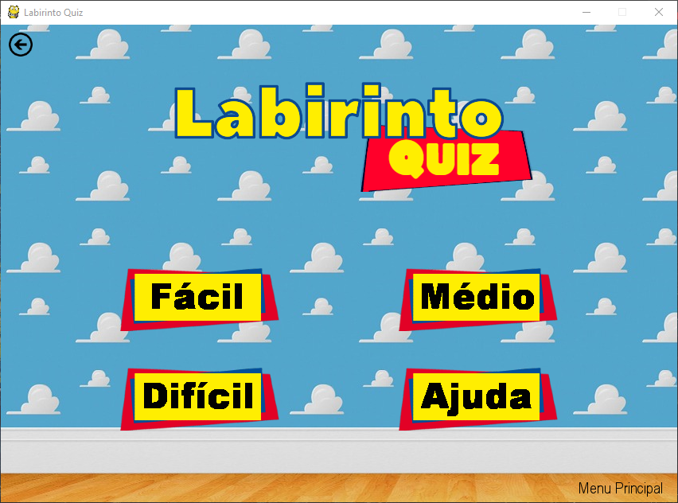
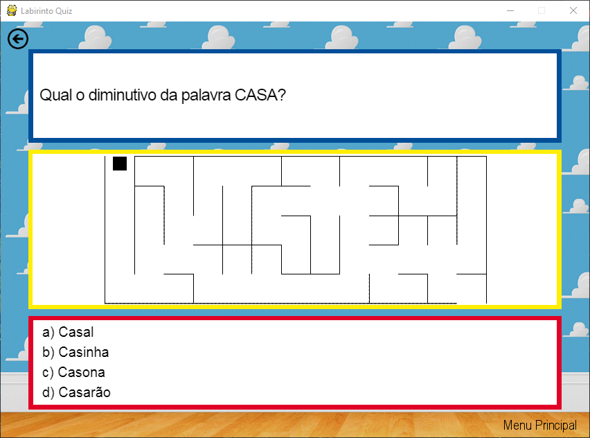

# 🎮 Labirinto Quiz
<p align="center">
  <a href="https://www.pygame.org">
    
  </a>
</p>

<p align="justify">
  Programa desenvolvido utilizando a biblioteca Pygame da linguagem Python 3. Faz parte do <a href="https://github.com/projetoeducapy" title="Perfil do Projeto Educa.py no GitHub">Projeto Educa.py</a> que objetiva usar jogos digitais para promover uma educação inclusiva. O jogo foi pensado de modo a auxiliar no aprendizado de crianças do Ensino Fundamental nas disciplinas de Língua Portuguesa e Matemática.
</p>

## 🚀 Iniciando
1. É necessário ter uma versão de [Python](https://www.python.org "Página inicial de Python") ≥ 3.7.7 instalada em sua máquina

2. Intale a biblioteca [Pygame](https://www.pygame.org/wiki/GettingStarted "Instalação da biblioteca Pygame") em sua máquina
  ```
  python3 -m pip install -U pygame --user
  ```

3. Baixe o repositório
 - Usando Git
  ```
  git clone https://github.com/TavaresJonatas/Labirinto-Quiz.git
  ```
  - Usando GitHub CLI
  ```
  gh repo clone TavaresJonatas/Labirinto-Quiz
  ```
  > 💡 ou da maneira que você preferir

4. Execute o arquivo [main/labirinto.py](main/labirinto.py "Arquivo main/labirinto.py")
  - Abra o prompt de comando de sua máquina
  - Acesse o diretório onde o arquivo está
  - Inicie a execução
  ```
  python labirinto.py
  ```
  > 💡 ou da maneira que você preferir

## ⚡ Jogando
<p align="justify">
  O jogo, como objetiva alcançar crianças, tem um design infantil e bem intuitivo. Após seguir os passos anteriores e conseguir executar o jogo, basta escolher entre responder perguntas de Português ou Matemática e, em seguida, escolher entre os níveis Fácil, Médio ou Difícil. Feito isso, basta seguir as instruções exibidas na tela e responder corretamente as perguntas de múltipla escolha para avançar e chegar à saída do labirinto. Abaixo, seguem algumas capturas das principais telas do jogo.
</p>

<p align="center">
  <b>Figura 1</b> - Tela Inicial do Labirinto Quiz<br />
  <br />
  <b>Figura 2</b> - Tela de Menu do Labirinto Quiz<br />
  <br />
  <b>Figura 3</b> - Exemplo do Jogo Labirinto Quiz<br />
  
</p>

## 💻 Autor
<table>
  <tr align="center">
    <td><a href="https://github.com/TavaresJonatas" title="Jônatas Tavares"><br /><sub>Jônatas Tavares</sub></a></td>
  </tr>
</table>
